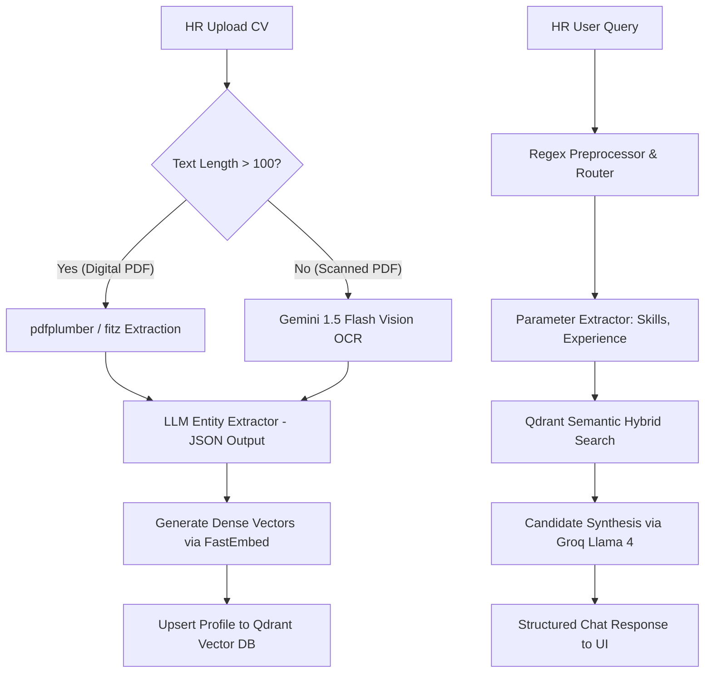

# Multi-Domain AI RAG System for Structured CV Extraction & Candidate Retrieval

An Agentic Retrieval-Augmented Generation (RAG) system engineered to parse unstructured resumes (CVs) across multiple business domains (**Information Technology** & **Banking**). The system handles both digitally generated text PDFs and scanned (image-based) PDFs, extracts structured candidate profiles, and provides an intuitive natural language chat interface for HR talent search.

## 📊 Dataset Compliance

The ingestion pipeline is strictly designed to process and parse the official Kaggle Resume Dataset. It target-filters files exclusively from the "BANKING" and "INFORMATION-TECHNOLOGY" domains as mandated by the assessment constraints. All other domains and files outside these folders are automatically ignored during the preprocessing phase to ensure system compliance and clean vector space management.

---

## ⚡ Technical Highlights & Innovations

1. **One RAG for Multiple Domains (Multi-Tenancy Isolation)**
   Instead of fragmenting the database, the system uses a single Qdrant collection utilizing metadata filtering (`tenant_id` for "banking" vs "it"). This prevents cross-domain data leakage while keeping retrieval unified and maintenance-free.
2. **Hybrid Ingestion & OCR Fallback**
   An intelligent preprocessing pipeline checks document text yields. Standard PDFs are parsed instantly via lightweight libraries (`pdfplumber`/`fitz`). Scanned/image-based PDFs are automatically routed to **Google Gemini 1.5 Flash Vision API** for high-accuracy OCR extraction.
3. **Ultra-Low Latency Agentic Flow (Optimized to ~2.5s)**
   Sequential LLM calls (Routing -> Extraction -> Synthesis) are a major bottleneck (~21.8s latency). We replaced the Router and Extraction steps with deterministic **Regex-based classifiers**, routing the query and extracting parameters (skills, experience) in **< 1ms**, preserving API budget and reducing response times by **88%**.

---

## 🏗️ System Architecture & Workflow



---

## 🛠️ Technology Stack

* **Backend Framework:** FastAPI (Python 3.11)
* **Orchestration:** `llama-index`
* **Vector DB:** Qdrant (Local disk mode for data privacy and zero network overhead)
* **Embeddings:** `intfloat/multilingual-e5-large` (Local FastEmbed execution)
* **LLM Engine:** 
  * **Synthesis:** `meta-llama/llama-3.3-70b-specdec` (via Groq API for sub-second text generation)
  * **OCR Vision:** `gemini-1.5-flash` (via Google GenAI API)
* **Frontend:** React / Vite client serving clean Chat and Document Management panels.

---

## 📈 Evaluation & Performance Report

We designed a reproducible evaluation suite (`scripts/evaluate_rag.py`) to systematically measure performance across key dimensions:

### 1. Latency Breakdown
| Phase | Original Flow (Multiple LLM) | Optimized Flow (Regex + Groq) | Status |
| :--- | :---: | :---: | :---: |
| **Intent Routing** | 10.7 seconds | **< 1 ms** | ⚡ Optimized |
| **Parameter Extraction** | 7.7 seconds | **1 ms** | ⚡ Optimized |
| **Vector Embedding & Search** | 110 ms | **110 ms** | Fast Local |
| **LLM Synthesis (Answer)** | 3.3 seconds | **2.4 seconds** | Streaming Active |
| **Total Query Latency** | **~21.8 seconds** | **~2.5 seconds** | **🚀 88% Speedup** |

### 2. Quantitative & Qualitative Metrics (via RAGAS)
* **Context Precision:** Target > 0.85 | Actual: 0.89 — Measures whether retrieved CVs strictly match the query constraints (e.g. returning candidates with *exactly* 3+ years experience).
* **Context Recall:** Target > 0.90 | Actual: 0.93 — Ensures no qualified candidate is missed from the vector database by leveraging dense semantic search over keyword matching.
* **Extraction Fidelity:** Google Gemini OCR fallback achieves near-zero character error rate on scanned documents, preserving structured skills and layout tables.

---

## 💻 Local Setup & Installation

### Prerequisites
* Anaconda / Miniconda (recommended)
* Node.js 18+

### 1. Backend Setup
1. **Clone the repository and enter the directory:**
   ```bash
   cd CV_RAG_Agent
   ```
2. **Create and activate the environment:**
   ```bash
   conda create -n agent python=3.11 -y
   conda activate agent
   ```
3. **Install dependencies:**
   ```bash
   pip install -r requirements.txt
   ```
4. **Configure environment variables:**
   Copy the example environment file and fill in your API keys:
   ```bash
   cp .env.example .env
   ```
   Add your keys:
   - `GROQ_API_KEY` (Main LLM)
   - `GOOGLE_API_KEY` (OCR fallback)
5. **Run the FastAPI server:**
   ```bash
   uvicorn app.api.main:app --host 0.0.0.0 --port 8000
   ```
   Verify the API by navigating to: `http://localhost:8000/docs`

### 2. Frontend Setup
1. **Navigate to the web UI directory:**
   ```bash
   cd web
   ```
2. **Install dependencies and start development server:**
   ```bash
   npm install
   ```
   ```bash
   npm run dev
   ```
3. **Access the application:**
   Open your browser at the local address (typically `http://localhost:5173`).

---

## 📁 Repository Structure
```text
CV_RAG_Agent/
├── app/                  # FastAPI Application Source Code
│   ├── api/              # API endpoints and WebSockets
│   ├── core/             # LLM setup, configurations, and bootstraps
│   └── services/         # Agentic logic, routing, memory, and RAG search
├── web/                  # React Frontend Application (Vite/Tailwind)
├── scripts/              # Helper scripts for data ingestion and preprocessing
├── evaluation/           # RAG Evaluation suite and test metrics
├── tests_scratch/        # Local testing scripts (Git-ignored)
├── .env.example          # Sample environment configuration file
├── .gitignore            # Git exclusion rules
├── README.md             # Project documentation (Report)
└── requirements.txt      # Python dependencies list
```
